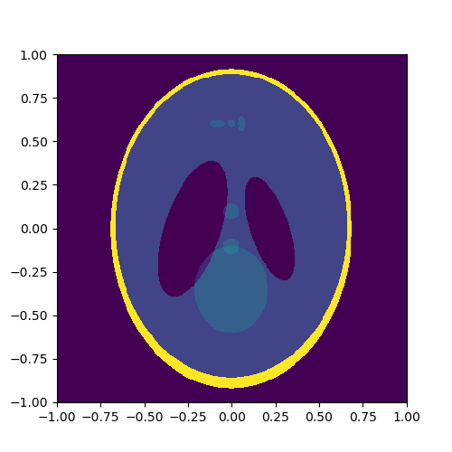
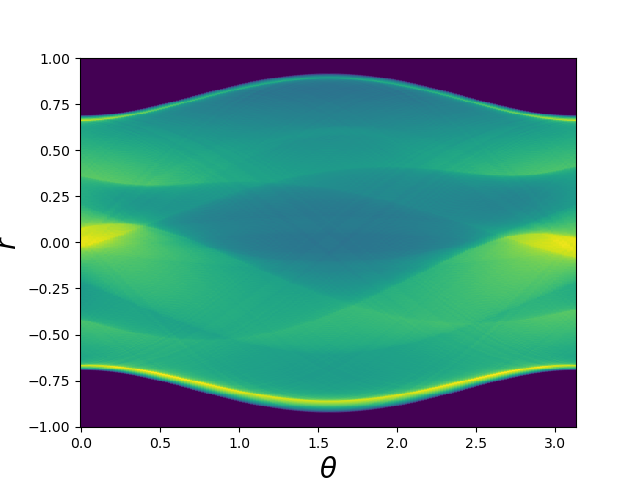
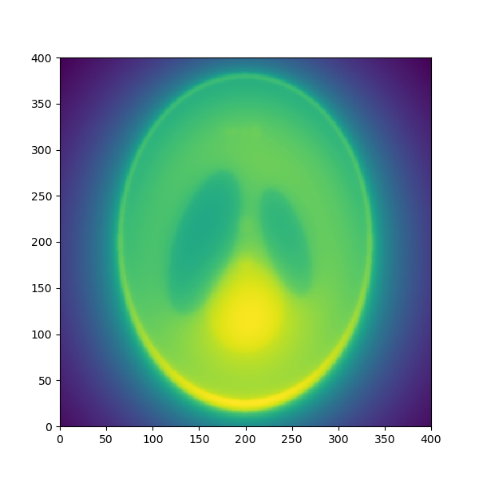
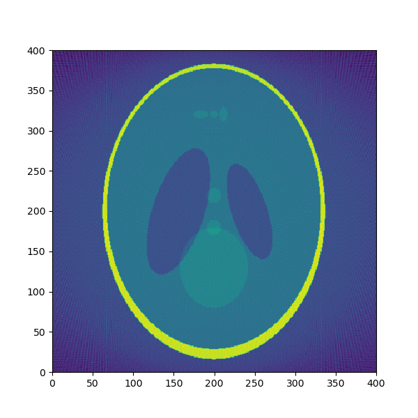
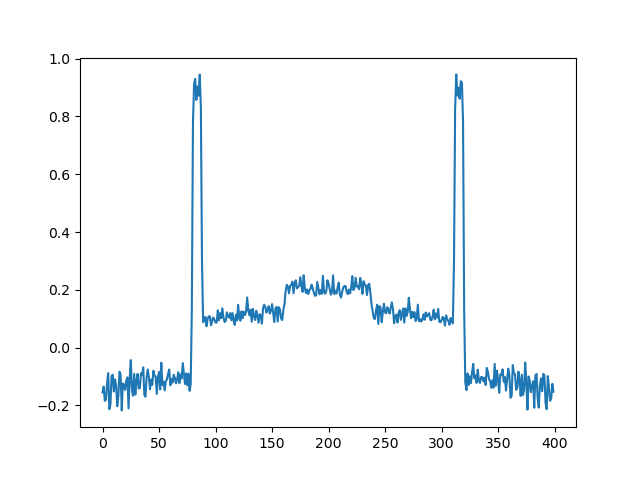

# Tomographic Reconstruction

This project demonstrates the process of reconstructing images from tomographic data using custom methods. The primary focus is on the Shepp-Logan phantom, a widely used digital phantom for testing and validating image reconstruction algorithms.

## Demo - Shepp-Logan phantom

Below is an overview of the tomographic reconstruction process. The images are shown side by side to illustrate each step.

<p align="center">
  
  
  
  
  
</p>

<p align="center">
  <b>Original Image</b> &emsp; <b>Sinogram</b> &emsp; <b>Filtered Back Projection</b> &emsp; <b>Reconstructed Image</b> &emsp; <b>Slice of Reconstructed Image</b>
</p>

## Reconstruction Steps

The following images illustrate different stages and methods of tomographic reconstruction using the Shepp-Logan phantom:
The Shepp-Logan phantom is a digital phantom that simulates the attenuation profiles of different anatomical structures. It is commonly used in the field of computed tomography (CT) for testing and benchmarking reconstruction algorithms.


### Original Image
This image shows the original Shepp-Logan phantom before any transformations or reconstruction algorithms are applied.


### Sinogram
This image represents the sinogram obtained from the Radon transform of the original Shepp-Logan phantom. The sinogram captures the projections of the phantom at various angles.


### Filtered Back Projection (FBP)
This image shows the result of the custom filtered back projection (FBP) method applied to the sinogram. FBP is a classic reconstruction technique used to reconstruct images from projection data.


### Reconstructed Image
This image displays the result of the custom reconstruction using Fourier transforms and interpolation techniques. It demonstrates an alternative reconstruction method based on frequency domain processing.


### Slice of Reconstructed Image
This plot shows a specific slice (the 110th row) of the reconstructed image. It provides a detailed view of the reconstruction result.


## How to Run the Code

To execute the code and generate these images, follow these steps:

1. **Clone the Repository:**

```bash
git clone https://github.com/guibo-tech/Tomographic-Reconstruction.git
```

2. **Install Dependencies:**

Ensure you have the necessary libraries installed. You can install the required dependencies using:

    ```bash
    pip install -r requirements.txt
    ```

3. **Run the Script:**

Load any digital CT image and execute the [script](project/CT_reconstructor.py).


