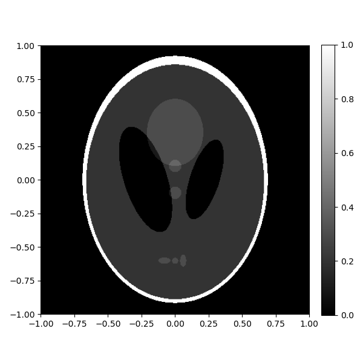
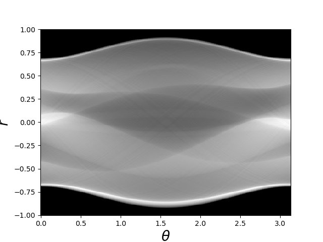
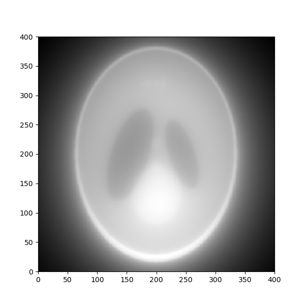
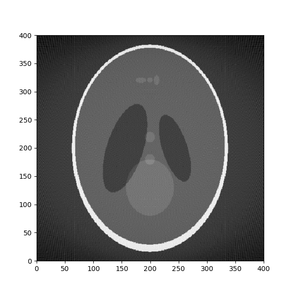

# Tomographic Reconstruction
Project to reconstruct CT scans.

## Original Image
This image shows the original reconstructed image using the custom method.

## Sinogram
This image represents the sinogram obtained from the Radon transform of the original image.

## Filtered Back Projection
This image shows the result of the filtered back projection (FBP) method for reconstruction.

## Reconstructed Image
This image displays the result of the reconstruction using the standard `iradon` method.

